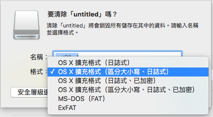

# 環境設定

歡迎來學習並開發AOSP！本章節將教導大家如何在Mac上設定好你的AOSP開發環境。


## 準備好開發AOSP要用的磁區

一個不好的消息是，如果要開發AOSP你最少要準備約100GB的磁碟空間。如果你的Mac是總容量較小的型號，那要準備出這個空間可不容易呀！不過沒關係，這部份你可以準備一張128GB的高速SD卡來代替！(如果你用的是外接硬碟，則設定同SD卡。不過USB的傳輸速度很慢，所以還是建議用SD卡)

以下有兩個準備空間的選項，請依照你的需求選擇其一即可

1. [分割AOSP磁區](#disk_option1)
2. [使用外接128G(以上)的SD記憶卡](#disk_option2)

### <a name="disk_option1"> 選項1 - 分割AOSP磁區 </a>

由於Mac上的File System(檔案系統)不分大小寫，所以我們要先切一塊磁區出來，並 使用分大小寫的File System

```shell
$ hdiutil create -type SPARSE -fs 'Case-sensitive Journaled HFS+' -size 150g ~/android.dmg
```

官方文件是建議切40G出來，但最新(AOSP上的master branch)光下載source code就38G了……這邊建議是直接切150G(不夠也不用擔心，這個之後還能調大)

接著會在你的家目錄(`$ ~/`)下找到剛建立出來的磁區`android.img`(也有可能被叫做`android.img.sparseimage`)。
以下為了方便，我們統一把他命名成`android.img.sparseimage`

```shell
$ mv ~/android.img ~/android.img.sparseimage # 僅在你建出來的磁區叫做android.img.sparseimage時才需做這個步驟
```

如果之後需要修改這個磁區的大小，可以使用以下指令：

```shell
$ hdiutil resize -size <new-size-you-want>g ~/android.dmg.sparseimage
```

#### 建立mountAndroid及umountAndroid指令

由於切出來的這個磁區有點像是在電腦內切出一個USB磁碟，所以這個USB是需要插入(`mount`指令)後才能用的。當然可以插入就可以拔出來(`umount`指令)。而因為這兩個指令其實不是很好背，所以我們來為我們的CLI建立兩個方便插拔Android磁區的指令

打開`~/.bash_profile`，加入以下兩段內容：

* 指令1: mountAndroid

```shell
# mount the android file image
function mountAndroid { hdiutil attach ~/android.dmg -mountpoint /Volumes/android; }
```

* 指令2: umountAndroid

```shell
# unmount the android file image
function umountAndroid() { hdiutil detach /Volumes/android; }
```

完成後，重開你的terminal，便可以使用mountAndroid及umountAndroid了指令了。

`mountAndroid`指令會將android磁區插到`/Volumes/android`的位置。相對的`umountAndroid`就是拔下嘍

當然啦，因為這個磁區就像是插上電腦的一樣，所以你也可以打開finder手動退出它


### <a name="disk_option1"> 選項2 - [使用外接128G(以上)的SD記憶卡] </a>

由於AOSP所需要的是區分大小寫的磁區，所以我們要將SD記憶卡給格式化成我們需要的格式。

請依下列步驟

1. 插上SD記憶卡
2. 請確定記憶卡內沒有任何需要的資料，過程中記憶卡的資料將*永久*消失
3. 打開你電腦中的**`磁碟工具程式`**
4. 選擇SD記憶卡後，按下**`清除`**標籤
5. 名稱隨意取一個，但保險起見不要有空格
6. 格式請選擇**`OS X 擴充格式 (區分大小寫、日誌式)`**
7. 按下**`清除`**按鈕
8. 完成！



```shell
$ hdiutil create -type SPARSE -fs 'Case-sensitive Journaled HFS+' -size 150g ~/android.dmg
```

## 安裝需要的library和套件

請參考[官網](https://source.android.com/source/requirements.html)，一般來說Android app開發者該裝的都裝過了。

雖然官網上有一段是用MacPort，但我本身覺得homebrew比較好而不喜歡MacPort，所以我是安裝[homebrew](http://brew.sh/)

```shell
$ brew install gnupg # 安裝 guupg
```

Mac上應該已經內建`git`1.7+(可用`git --version`查)及`python` 2.7.+(可用`python --version`查，注意如果是3.x以上是不行的，非2.7不可)

以下是官網沒提到，但實際上你需要安裝的libraries

```shell
$ brew install cmake # 取代gnu-make
$ brew install ninja # ninja-build，Android 7.0開始使用的新build code機制(用來取代GNU make)
$ brew install xz  # ninja-build過程會用到
```

`curl`也必需安裝，但這邊有個特殊情況。Mac內建就有一個curl，但用內建的會有問題，所以我們還是必需裝一份。而這邊不能直接用`brew install curl`裝，因為AOSP需要的`curl`必需是用`openssl`來編譯，但預設`brw install curl`並不是用`openssl`這個library來編，所以這邊在安裝時要用：

```
$ brew install curl --with-openssl # 先裝起來，下一章再處理選用自己裝的curl這件事。
```

## 調高FD上限

MacOS預設上有限制最大FD開啟數量，而這個數量不夠我們Build AOSP
因此必需調高它。

在`~/.bash_profile`內加入以下程式碼

```shell
# set the number of open files to be 1024
ulimit -S -n 1024
```

<TODO 優化Build系統(原理是做cache，但因為mac容量有限所以我覺得別設比較好……)>

至此，基本環境設定就算完成了！

[下一章：下載AOSP程式碼](/ch2_download)

## Reference
* [AOSP官方設定(英)](https://source.android.com/source/initializing.html)
