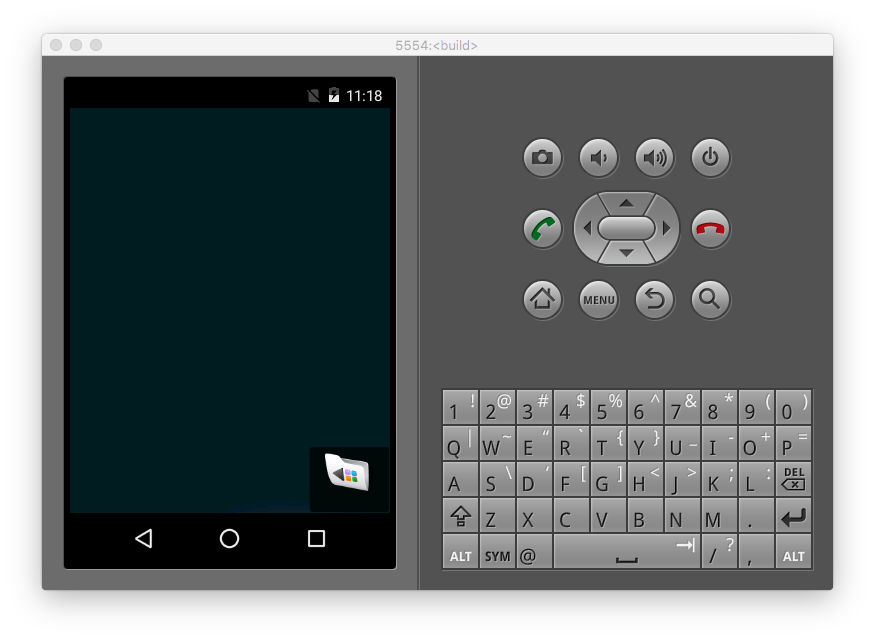

# Build

[上一章：下載AOSP程式碼](/ch2_download)

這章節將正式編譯AOSP原始碼並打開模擬器。

## 設定環境變數

由於我們的環境是Mac，所以環境變數的設定要改其中兩個路徑：

1. `$ANDROID_JAVA_HOME` 要正確選到Java8的版本
2. 要選我們用homebrew自己安裝的`curl`，而不要用預設的`curl`

再加上原本就需要的`source build/envsetup.sh`也要做。這一個動作會將AOSP預設所有環境變數設好。總體來說我們要做的就是：

```shell
$ export ANDROID_JAVA_HOME=$(/usr/libexec/java_home -v1.8)
$ source build/envsetup.sh
$ export PATH=$(brew --prefix curl)/bin:$PATH # Use newer curl
```

這樣就算完成環境變數的設定了。請注意這個設定會在你關掉終端機頁面後消失，如果開了新的終端機頁面就要重新設定。

***完成環境變數設定後，`$TOP`會被設定成AOSP原始碼的根目錄，以下如果提到`$TOP`這個位置，則皆指AOSP原始碼根目錄。(以目前為止的範例來說，會是在`/Volumes/android/aosp`)***

## 選擇要build的img類型

在已經設定好環境變數的shell內輸入

```
$ lunch
```

會跳出如下的選項

```
 /Volumes/android/aosp/ lunch

You're building on Darwin

Lunch menu... pick a combo:
     1. aosp_arm-eng
     2. aosp_arm64-eng
     3. aosp_mips-eng
     4. aosp_mips64-eng
     5. aosp_x86-eng
     6. aosp_x86_64-eng
     7. aosp_deb-userdebug
     8. aosp_flo-userdebug
     9. full_fugu-userdebug
     10. aosp_fugu-userdebug
     11. mini_emulator_arm64-userdebug
     12. m_e_arm-userdebug
     13. mini_emulator_mips-userdebug
     14. mini_emulator_x86-userdebug
     15. mini_emulator_x86_64-userdebug
     16. aosp_flounder-userdebug
     17. aosp_angler-userdebug
     18. aosp_bullhead-userdebug
     19. aosp_hammerhead-userdebug
     20. aosp_hammerhead_fp-userdebug
     21. hikey-userdebug
     22. aosp_shamu-userdebug

Which would you like? [aosp_arm-eng] 
```

這邊我推薦使用`aosp_x86_64-eng`，這個選項，`mini_emulator_x86_64-userdebug`編譯出來的結果約需要30G。

----

照理說用`mini_emulator_x86_64-userdebug`也是可行的，但這個mini其實也是需要約30G，沒省到哪…
另外eng會比userdebug有更多的debug工具(下面會提到)。
而且不知道為什麼，筆者用`mini_emulator_x86_64-userdebug`的emulator沒辦法使用`adb`連線！目前看來是個AOSP bug，但這會導致之後我們非常難以開發AOSP，所以這邊**強烈推薦用`aosp_x86_64-eng`**。

----

如果是用Mac系統的話，無論如何都建議使用x86_64類型的選項，因為x86_64有支援HAXM，可以讓你的模擬器跑的很快。不過如果是用Linux系統就沒辦法了，因為HAXM並不支援Linux，這時就看喜好了。通常在Linux開發的人會採用arm_64，因為主流手機大部份都是arm_64。不過我們並沒有要做硬體相關的修改而是只打算研究AOSP framework，所以在Mac上開發選能用HAXM加速的選項。


### 三種build type的差別

|Build Type| 說明
|----------|:---
| user     |正式的產品會用這個Build Type，也因為是正式產品要用的所以權限上有限制(不能root之類的)
| userdebug|同user，但將權限全開。最推薦的Build Type
| eng      |開發用的Build Type，有追加許多不存在於userdebug版本中的除錯工具。

顯然的，因為我們是要開發/研究AOSP，所以就選userdebug或eng嘍。

## 修改部份程式碼以通過編譯

### 問題：Max Property Name

作者在2016/8/5時進行編譯有碰到一些問題，所以這邊先把這個問題處理掉。在底下的TroubleShooting也可以找到一樣的問題。

* 修改`AOSP_TOP/build/tools/post_process_props.py`這個檔案，找到`PROP_VALUE_MAX = 91`並把它改成`128`，如下：

```python
PROP_NAME_MAX = 31
# PROP_VALUE_MAX = 91
PROP_VALUE_MAX = 128
```

* 修改`AOSP_TOP/bionic/libc/include/sys/system_properties.h`這個檔案，找到`#define PROP_VALUE_MAX 92`並把它改成`128`，如下：

```c
#define PROP_NAME_MAX   32
// #define PROP_VALUE_MAX  92
#define PROP_VALUE_MAX  128
```

完成！

## 編譯AOSP原始碼

在完成上述步驟後的shell內輸入

```shell
$ make -j8
```

就會開始編AOSP了。大概2至3個小時會完成。當中的`-j8`表示最高可以同時開8個平行的Thread來做編譯的動作，建議這邊輸入和你的CPU核心數一樣的數字。

如果怕編譯過程出錯而想將Log給記錄下來的話，可以用[`tee`](/appendix/cli-tools/tee.md)工具記錄：

```shell
$ make -j8 | tee build.log
```

同樣的，如果要放整晚的話，請加上[`caffeinate`](/appendix/cli-tools/caffeinate.md)指令，例如

```shell
$ caffeinate make -j8 | tee build.log
```

### Clean Build

在某些情況下你可能會需要Clean Build(我希望各位不會有這個需要)，如果有這個需要請在設定好的開發環境上輸入以下指令：

```shell
$ make clobber
```

這個指令會將之前編譯過的東西都清掉，清完後再重新做`$ make -j8`即可

## 啟動emulator

只要在設定好環境變數的shell輸入

```shell
$ emulator
```

就可以打開emulator(模擬器)了。

打開後會是一台營幕很小的emulator，如圖：


如果選了mini類的emulator，會非常簡陋，大概長這樣：



## Option: 為未來設定方便的開發環境

在往後的過程我們還是會常常會(部份/全部)編譯AOSP，如果每次都要照這份文件跑一次那也太煩了吧？所以這邊可以順便設定一個簡單的檔案幫我們做這件事：
在`$TOP`下建立一個檔案叫`setup`，並輸入以下內容：

```shell
export ANDROID_JAVA_HOME=$(/usr/libexec/java_home -v1.8)
source build/envsetup.sh
export PATH=$(brew --prefix curl)/bin:$PATH # Use curl of homebrew
lunch 7 # build aosp_x86_64-eng
```

***這裡有個奇怪的AOSP Bug，明明`aosp_x86_64-eng`在`lunch`的選單表裡面編號是6，但實際測試後其實是7才對***，如果你不是很確定到底要用`lunch 6`還是`lunch 7`那可以在執行後看一下出現的訊息是不是和下面所列出來的一樣

```shell
 /Volumes/android/aosp/ lunch 7
find: vendor: No such file or directory

============================================
PLATFORM_VERSION_CODENAME=REL
PLATFORM_VERSION=6.0.1
TARGET_PRODUCT=aosp_x86_64
TARGET_BUILD_VARIANT=eng
TARGET_BUILD_TYPE=release
TARGET_BUILD_APPS=
TARGET_ARCH=x86_64
TARGET_ARCH_VARIANT=x86_64
TARGET_CPU_VARIANT=
TARGET_2ND_ARCH=x86
TARGET_2ND_ARCH_VARIANT=x86_64
TARGET_2ND_CPU_VARIANT=
HOST_ARCH=x86_64
HOST_2ND_ARCH=x86
HOST_OS=darwin
HOST_OS_EXTRA=Darwin-15.6.0-x86_64-i386-64bit
HOST_CROSS_OS=
HOST_CROSS_ARCH=
HOST_CROSS_2ND_ARCH=
HOST_BUILD_TYPE=release
BUILD_ID=MASTER
OUT_DIR=out
AUX_OS_VARIANT_LIST=
============================================
 /Volumes/android/aosp/
```

要注意的是`TARGET_PRODUCT=aosp_x86_64`和`TARGET_ARCH=x86_64`，如果都一樣就沒問題了。

如果你不是選`aosp_x86_64-eng`的話，`lunch`後面的數字請自己改成對應的項目

之後每當我們要設定環境時，只要先切到AOSP原始碼的根目錄，再輸入

```shell
source setup
```

這樣環境就都設定好了。
(`source`工具其實就是讀一個檔案然後把檔案的內容當成command執行，所以`source setup`就是把`setup`這個檔案裡面的每一行指令給自動依序執行一遍)

## 完成！

到此你應該已經可以打開模擬器了，接下來就要介紹如何將你的AOSP程式碼燒(flash)進模擬器裡面。

[下一章：燒入客製的AOSP image](/ch4_flash)

## TroubleShoot
### fingerprint

```
error: ro.build.fingerprint cannot exceed 91 bytes: Android/mini_emulator_x86_64/mini-emulator-x86_64:6.0.1/MASTER/cha12208042258:userdebug/test-keys (97)
```
[Stack Overflow](http://stackoverflow.com/questions/28776970/android-build-error-ro-build-fingerprint-cannot-exceed-91-bytes)

### CURL

```
Unsupported curl, please use a curl not based on SecureTransport
```
[Stack Overflow](http://stackoverflow.com/questions/33318756/while-i-make-the-source-of-android-6-0-it-failed)
